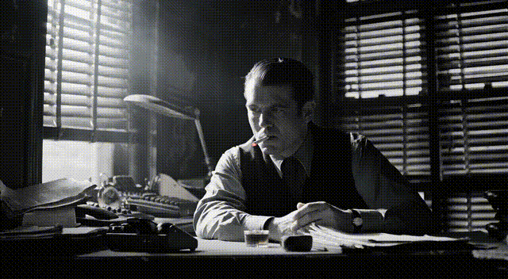
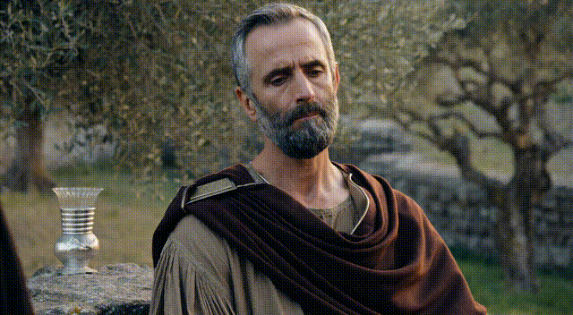
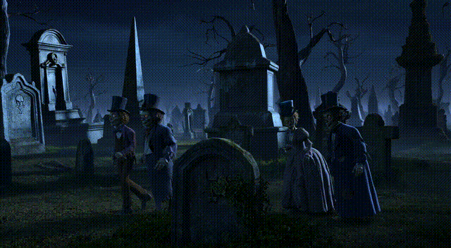
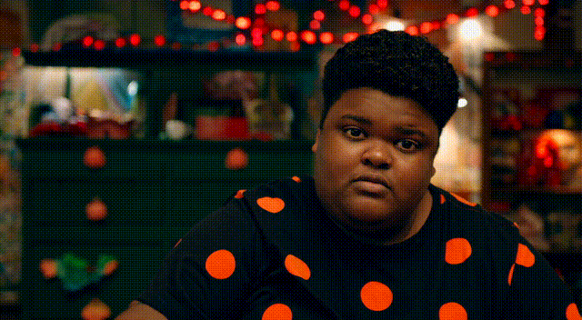
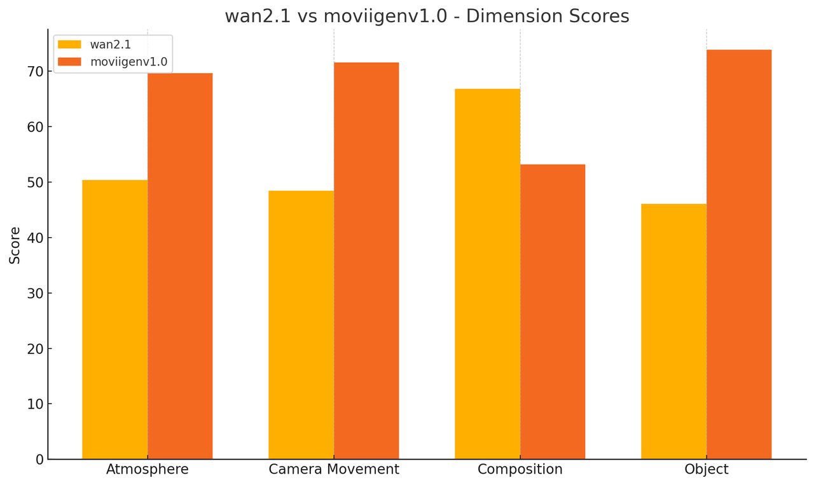
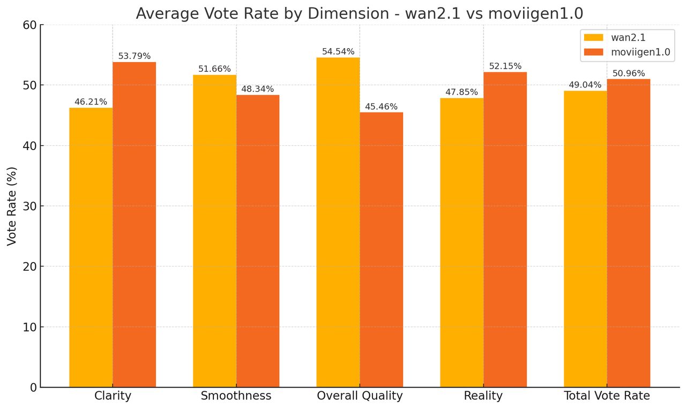

# MoviiGen 1.1

[](https://huggingface.co/ZuluVision/MoviiGen1.1)
[](https://github.com/ZulutionAI/MoviiGen1.1/stargazers)


[**MoviiGen 1.1: Towards Cinematic-Quality Video Generative Models**]("https://huggingface.co/ZuluVision/MoviiGen1.1") <be>

In this repository, we present **MoviiGen 1.1**, a cutting-edge video generation model that excels in cinematic aesthetics and visual quality. This model is a fine-tuning model based on the Wan2.1. Based on comprehensive evaluations by 11 professional filmmakers and AIGC creators, including industry experts, across 60 aesthetic dimensions, **MoviiGen 1.1** demonstrates superior performance in key cinematic aspects:

- 👍 **Superior Cinematic Aesthetics**: **MoviiGen 1.1** outperforms competitors in three critical dimensions: atmosphere creation, camera movement, and object detail preservation, making it the preferred choice for professional cinematic applications. 
- 👍 **Visual Coherence & Quality**: MoviiGen 1.1 excels in clarity (+14.6%) and realism (+4.3%), making it ideal for high-fidelity scenarios such as real-scene conversion and portrait detail. Wan2.1 stands out in smoothness and overall visual harmony, better suited for tasks emphasizing composition, coherence, and artistic style. Both models have close overall scores, so users can select MoviiGen 1.1 for clarity and realism, or Wan2.1 for style and structural consistency.
- 👍 **Comprehensive Visual Capabilities**: **MoviiGen 1.1** provides stable performance in complex visual scenarios, ensuring consistent subject and scene representation while maintaining high-quality motion dynamics.
- 👍 **High-Quality Output**: The model generates videos with exceptional clarity and detail, supporting both 720P and 1080P resolutions while maintaining consistent visual quality throughout the sequence.
- 👍 **Professional-Grade Results**: **MoviiGen 1.1** is particularly well-suited for applications where cinematic quality, visual coherence, and aesthetic excellence are paramount, offering superior overall quality compared to other models.

This repository features our latest model, which establishes new benchmarks in cinematic video generation. Through extensive evaluation by industry professionals, it has demonstrated exceptional capabilities in creating high-quality visuals with natural motion dynamics and consistent aesthetic quality, making it an ideal choice for professional video production and creative applications.

## Video Demos

|  |  |  |
|--------|--------|--------|
|  |  |  |
|  |  |  |
|  |  |  |


## 🔥 Latest News!!
* May 17, 2025: 👋 We've released the inference code and **training code** and weights of MoviiGen1.1.
* May 12, 2025: 👋 We've released weights of MoviiGen1.1.

## 💡 Quickstart

#### Installation
Clone the repo:
```
git clone https://github.com/ZulutionAI/MoviiGen1.1.git
cd MoviiGen1.1
```

1. Install dependencies:
```
# Ensure torch >= 2.4.0
pip install -r requirements.txt
```
2. Install [FastVideo](https://github.com/hao-ai-lab/FastVideo) according to their instructions.

#### Model Download

T2V-14B  Model: 🤗 [Huggingface](https://huggingface.co/ZuluVision/MoviiGen1.1) 
MoviiGen1.1 model supports both 720P and 1080P. For more cinematic quality, we recommend using 1080P and a 21:9 aspect ratio (1920*832).

Download models using huggingface-cli:
```
pip install "huggingface_hub[cli]"
huggingface-cli download ZuluVision/MoviiGen1.1 --local-dir ./MoviiGen1.1
```
## 🎥 Inference

Inference without prompt extend:

```bash
PYTHONPATH=. python scripts/inference/generate.py --ckpt_dir ./MoviiGen1.1 --prompt "Inside a smoky, atmospheric private eye office bathed in dramatic film noir lighting, sharp shadows from slatted blinds cut across a cluttered desk and worn surroundings, evoking the classic style by 1940s film. A world-weary detective is sitting behind the desk. He is smoking a cigarette, slowly bringing it to his lips, inhaling, and exhaling a plume of smoke that drifts in the harsh, directional light. The scene is rendered in stark black and white, creating a high-contrast, cinematic mood. The camera holds a static medium shot focused on the detective, emphasizing the gritty texture and oppressive atmosphere."
```

Inference with prompt extend:

We provide a prompt extend model for MoviiGen1.1, which is a fine-tuned Qwen2.5-7B-Instruct model with our internal data. Model is available on 🤗 [Huggingface](https://huggingface.co/ZuluVision/MoviiGen1.1_Prompt_Rewriter).

```bash
PYTHONPATH=. python scripts/inference/generate.py --ckpt_dir ./MoviiGen1.1 --prompt "A beautiful woman in a red dress is walking on the street." --use_prompt_extend --prompt_extend_model ZuluVision/MoviiGen1.1_Prompt_Rewriter
```

Prompt Tips:

- **Prompt Length**: The prompt length should be around 100~200.
- **Prompt Content**: The prompt should contain **scene description**, **main subject**, **events**, **aesthetics description** and **camera movement**.
- **Example**: 
```
Scene Description: A smoky, atmospheric private eye office bathed in dramatic film noir lighting, sharp shadows from slatted blinds cut across a cluttered desk and worn surroundings, evoking the classic style by 1940s film.
Main Subject: A world-weary detective is sitting behind the desk.
Events: He is smoking a cigarette, slowly bringing it to his lips, inhaling, and exhaling a plume of smoke that drifts in the harsh, directional light.
Aesthetics Description: The scene is rendered in stark black and white, creating a high-contrast, cinematic mood.
Camera Movement: The camera holds a static medium shot focused on the detective, emphasizing the gritty texture and oppressive atmosphere.

Final Prompt:
A smoky, atmospheric private eye office bathed in dramatic film noir lighting, sharp shadows from slatted blinds cut across a cluttered desk and worn surroundings, evoking the classic style by 1940s film. A world-weary detective is sitting behind the desk. He is smoking a cigarette, slowly bringing it to his lips, inhaling, and exhaling a plume of smoke that drifts in the harsh, directional light. The scene is rendered in stark black and white, creating a high-contrast, cinematic mood. The camera holds a static medium shot focused on the detective, emphasizing the gritty texture and oppressive atmosphere.
```

## 🛠️ Training

### Training Framework

Our training framework is built on [FastVideo](https://github.com/hao-ai-lab/FastVideo), with custom implementation of sequence parallel to optimize memory usage and training efficiency. The sequence parallel approach allows us to distribute the computational load across multiple GPUs, enabling efficient training of large-scale video generation models.

#### Key Features:

- **Sequence Parallel & Ring Attention**: Our custom implementation divides the temporal dimension across multiple GPUs, reducing per-device memory requirements while maintaining model quality.
- **Efficient Data Loading**: Optimized data pipeline for handling high-resolution video frames (Latent Cache and Text Embedding Cache). 
- **Multi Resolution Training Bucket**: Support for training at multiple resolutions.
- **Mixed Precision Training**: Support for BF16/FP16 training to accelerate computation.
- **Distributed Training**: Seamless multi-node, multi-GPU training support.

### Data Preprocessing

We cache the videos and corresponding text prompts as latents and text embeddings to optimize the training process. This preprocessing step significantly improves training efficiency by reducing computational overhead during the training phase. You need to provide a **merge.txt** file to specify the dataset path. And the dataset should be a json like **training_data.json**. Finally, you will get **video_caption.json** which contains the latents and text embeddings paths. 

```bash
bash scripts/data_preprocess/preprocess.sh
```
Example Data Format:

**merge.txt**
```txt
relative_path_to_json_dir, training_data.json
```

**training_data.json**
```json
[
    {
        "cap": "your prompt",
        "path": "path/to/your/video.mp4",
        "resolution": {
            "width": 3840,
            "height": 2160
        },
        "fps": 23.976023976023978,
        "duration": 1.4180833333333331
    },
    ...
]
```

Output Json:

**video_caption.json**
```json
[
    {
        "latent_path": "path/to/your/latent.pt",
        "prompt_embed_path": "path/to/your/prompt_embed.pt",
        "length": 12
    },
    ...
]
```

### Train
```bash
bash scripts/train/finetune.sh
```

**When multi-node training, you need to set the number of nodes and the number of processes per node manually.** We provide a sample script for multi-node training.

```bash
bash scripts/train/finetune_multi_node.sh
```


## Manual Evaluation

<div style="display: flex; justify-content: space-between;">
    <div style="flex: 1; margin-right: 10px;"></div>
    <div style="flex: 1;"></div>
</div>